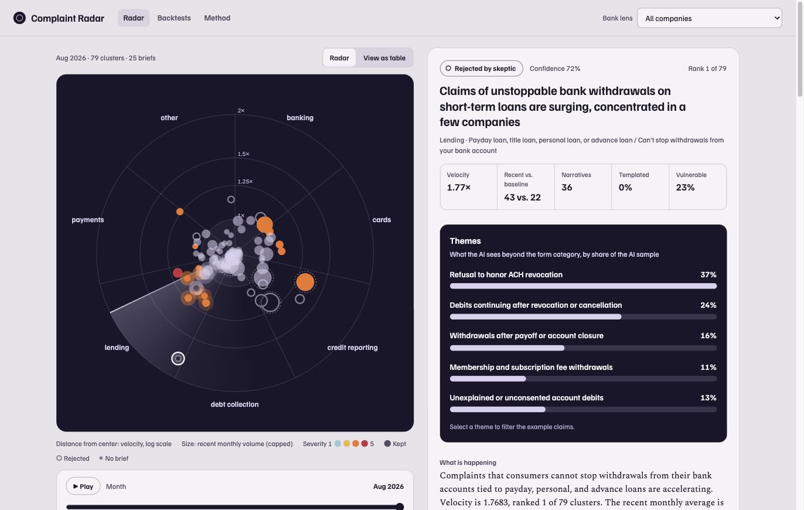
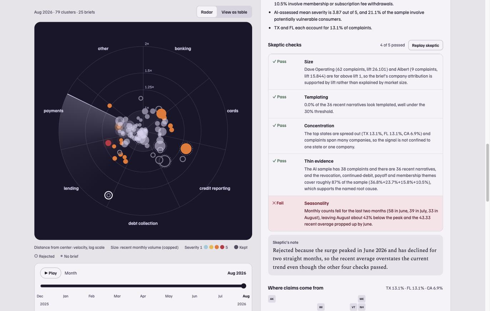
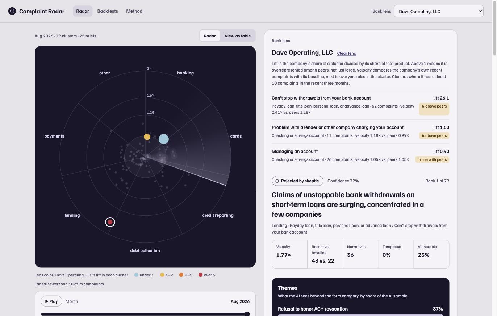
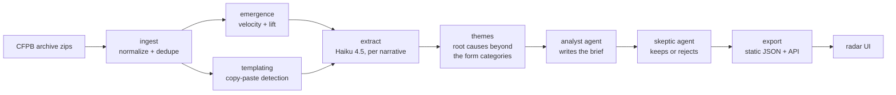

# Complaint Radar

**Live demo: https://complaint-radar-leonac24s-projects.vercel.app**

An early-warning radar for consumer finance risk. Complaint Radar reads real consumer
complaints about financial companies, finds issues that are accelerating before they
become regulatory or reputational problems, explains the likely root cause, and has a
skeptic agent reject weak signals.

## Why this exists

In August 2026 the CFPB stopped publishing complaint narratives and visualizations in
its public Consumer Complaint Database. It still collects complaints and shares them
with regulators, and it published an archive of complaints received from December 1,
2011 through August 14, 2026.

That archive shows what a public early-warning view could reveal. Complaint Radar runs
on it, and the same pipeline could run on a bank's own complaint data.

Complaints are **unverified allegations**. Everything here treats them as claims or
signals, never as findings of wrongdoing.



| The skeptic at work | Bank lens: lift and velocity against peers |
|---|---|
|  |  |

## How it works



**No-AI steps**

- **Emergence.** A cluster is a `(product, issue)` pair. Velocity compares the last
  3 months with the 6 before them:
  `(recent mean + 5) / (baseline mean + 5)`. Clusters averaging fewer than 30
  complaints a month are dropped.
- **Lift.** A company's share of a cluster divided by its share of the same
  product. Lift above 1 means a company is over-represented among its peers, not just
  big. Companies are never ranked by raw count.
- **Templating.** Narratives are fingerprinted after stripping redactions and
  punctuation. A fingerprint seen 5 or more times marks a form letter or copy-paste
  campaign, which can fake a spike.

**AI steps**

- **Extract** (Claude Haiku 4.5, Message Batches API). Up to 40 recent narratives
  per cluster are turned into structured fields: root cause, harm, money at stake,
  severity, vulnerable consumer, and a one-sentence neutral summary. Results are cached
  by complaint ID, so nothing is paid for twice.
- **Themes.** Root causes in each cluster are consolidated into 2 to 5 labeled
  themes. This is where the AI sees more than the CFPB's form categories.
- **Analyst agent.** Writes a brief for a bank executive: what is happening, who is
  affected, the likely root cause (framed as a hypothesis), and which internal process
  or control to check.
- **Skeptic agent.** Reviews every brief against the same evidence with five checks:
  size (lift), templating, concentration, thin evidence, and seasonality. Rejected
  briefs stay in the data and are shown as rejected.

## Results so far

From the RECENT window (September 2025 to August 2026):

- 6,884,299 unique complaints, 90% of them about credit reporting.
- 79 clusters pass the volume floor. The fastest is accelerating at 1.77x.
- 35% of narratives are templated; 8 of 79 clusters are at least 20% templated.
- Narrative share falls toward the end of the window (16% in September 2025, 1.5% in
  July 2026), which is consistent with a publication lag. Recent samples are thinner.

**The skeptic at work.** Of the top three clusters by velocity, it kept one brief and
rejected two:

| Cluster | Verdict | Skeptic's note |
|---|---|---|
| Payday/advance loans: can't stop withdrawals | Rejected | Peaked in June 2026 and fell for two straight months (58, 39, 33) |
| Credit reporting: dispute investigations (specialty reporters) | Rejected | Fell from 922 to 299 after a June peak; 4 recent narratives, half templated |
| Credit reporting: dispute investigations (national bureaus) | Kept | Broad, sustained, market-wide rise with low templating |

Across all 25 clusters the skeptic **kept 15 and rejected 10**. The checks that
failed:

| Check | Briefs failing it |
|---|---|
| Seasonality (a single peak, or falling for two months) | 8 |
| Thin evidence | 3 |
| Templating (30% or more of recent narratives) | 2 |
| Size (lift) | 0 |
| Concentration (one state or one company) | 0 |

A brief can fail more than one check.

**Theme stability.** Themes were generated twice for the payday "can't stop
withdrawals" cluster. Four of five themes matched in substance, and **90% of
complaint pairs were grouped the same way** in both runs. Word-for-word label overlap
is 0.50, because the runs phrase the same theme differently ("after payoff or closure"
vs. "after payoff or account closure"). The fifth theme differed: one run split out
data-security concerns, the other stop-payment orders.

**Extraction accuracy: 88% accurate, 100% accurate or partially (50 of 50 rated).**
The 50 random extractions in `data/work/review_sheet.csv` were rated against their
narratives by Claude Opus 5.5 during development, **not by a person**, so treat this
as a second-model check rather than human ground truth. No extraction was wrong.
The six partial ratings were real but limited errors: a summary calling a
buy-now-pay-later provider "a credit card issuer", two summaries adding a detail the
narrative does not state, one garbled summary, one false "templated" flag, and one
misframed root cause. Each has a note in the sheet. Very long narratives were judged
on their first ~2,200 characters.

**Backtests: 1 of 3 cases flagged.** The CFPB took no institutional enforcement actions
in 2026, so the cases are state actions, researched from public sources (links in
`backend/radar/backtest_cases.yaml`). Each cluster was chosen from the allegations
before the replay ran.

| Case | Public | Replay as of | Result |
|---|---|---|---|
| Colorado AG v. EarnIn (tips and expedited fees) | Aug 27, 2026 | Jul 2026 | **Flagged**: payday/advance "fees you didn't expect" ranked 15 of 79; skeptic kept the brief |
| Minnesota AG v. Brigit (advance fees) | Jun 10, 2026 | May 2026 | **Missed**: the same cluster ranked 51 of 81, outside the briefed top 25 |
| 41 state AGs v. Credit Acceptance (auto loans) | Sep 17, 2026 | Aug 2026 | **Missed**: vehicle "Repossession" ranked 52 of 79 |

Three cases are too few to measure a hit rate; they show the replay working and the
misses reported as plainly as the hit. Baltimore v. Dave (Dec 30, 2025) was left out
because replaying it needs data from before the loaded window. The payday "can't stop
withdrawals" cluster also stayed below the 30-a-month volume floor until June 2026.

## Running it

Requirements: Python 3.11+, [uv](https://docs.astral.sh/uv/), Node 18+ for the frontend,
and an Anthropic API key for the AI steps.

```bash
cp .env.example .env          # add ANTHROPIC_API_KEY
make setup                    # install backend dependencies
cd frontend && npm install    # install frontend dependencies
make test                     # no network or API key needed
```

Real data:

```bash
make data                     # download + normalize the CFPB archive (recent window)
make dry-run                  # show how many AI calls extract would make, and the cost
make pipeline                 # emergence, templating, extract, themes, analyst, skeptic, export
make api                      # serve public_data/ at http://localhost:8000/api
make web                      # radar UI at http://localhost:3000 (reads public_data/)
```

Deploy (static files only; no API key is involved). The Vercel project is connected to
this repo, so every push to `main` deploys; `vercel.json` builds `frontend/` and serves
its static export. To deploy without pushing, from `frontend/`:

```bash
vercel build --prod && vercel deploy --prebuilt --prod
```

Synthetic data, for development without a download:

```bash
make data-fixtures
```

Each step can also be run on its own: `cd backend && uv run python -m radar.cli <step>`.

Evaluation and backtests:

```bash
cd backend
uv run python -m radar.cli evaluate               # writes the review sheet, scores it once rated
uv run python -m radar.cli evaluate --stability   # also reruns themes twice (2 AI calls)
uv run python -m radar.cli backtest --dry-run     # cases from radar/backtest_cases.yaml
uv run python -m radar.cli backtest --as-of 2026-06 --cluster "<product> / <issue>"
make export                                        # publishes results to public_data/
```

### Cost

`extract` will not spend money without a confirmation or `--yes`, and `--dry-run`
prints the call count and estimated cost first.

The AI steps are one-time costs. Their outputs are saved to `data/`, extractions are
cached by complaint ID, and finished clusters are skipped on rerun. The deployed demo
reads precomputed JSON and makes no API calls.

Models are set in `.env`:

| Variable | Default | Used by |
|---|---|---|
| `RADAR_MODEL_FAST` | `claude-haiku-4-5-20251001` | extract |
| `RADAR_MODEL_WRITER` | `claude-sonnet-5-5` | analyst |
| `RADAR_MODEL_REASONING` | `claude-opus-5-5` | themes, skeptic |

Setting `RADAR_MODEL_REASONING=claude-sonnet-5-5` roughly halves the cost of a
25-cluster run.

## Repo layout

```
backend/radar/     pipeline steps, Claude client, agents, CLI
backend/tests/     synthetic CFPB-format fixtures and unit tests
frontend/          Next.js 14 radar UI (static export; reads public_data/)
data_spike/        original data exploration script
data/              downloaded and intermediate data (gitignored)
public_data/       precomputed JSON for the deployed demo
```

## Limitations

- **Unverified allegations.** Complaints are consumers' claims. A rising cluster is a
  signal to investigate, not evidence that a company did anything wrong.
- **Size normalization is relative.** Lift compares a company with others in the
  same product. It does not account for differences in customer mix within a product.
- **Templating.** Form letters and coordinated campaigns can inflate counts. They are
  detected and reported, not removed.
- **Sampling.** The AI reads up to 40 narratives per cluster, not every complaint.
  Themes and briefs describe that sample.
- **Narrative lag.** Fewer narratives are published for recent months, so the most
  recent signals have the least text behind them.
- **Label drift.** The CFPB uses near-duplicate issue labels, which can split one
  cluster in two.

## Data source

[CFPB Consumer Complaint Database narratives archive](https://www.consumerfinance.gov/foia-requests/foia-electronic-reading-room/cfpb-consumer-complaint-database-narratives-archive/).
The UI shows AI-written one-sentence summaries with the CFPB complaint ID, not the raw
narrative text.
